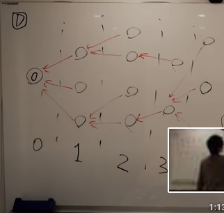

# 手法

# グラフ　最短路を検索するとき

N = 頂点数
M = 辺の数

B<=の時

|  BFS  |  ダイクストラ  |  ワーシャルフロイド  |　ベルマンフォード |
| ---- | ---- | ---- | ---- |
|  O(N)  |  O(MlogM)   |  O(N*N*N)  | O(NM) |
|  辺のコストが全部1の時  |  辺のコストが色々あるとき  |  実装が軽い。制約が小さい時、使う。密なグラフで全点間の距離が計算できる。 本質文が１行でかける。 |  負の変がある時

# BFS木

層にわかれている


# 用語集

* ラムダ式関数
https://cpprefjp.github.io/lang/cpp11/lambda_expressions.html

[&]	デフォルトで環境にある変数を参照して、ラムダ式のなかで使用する

```
auto plus = [](int a, int b) { return a + b; };
int result = plus(2, 3); // result == 5
```
ここでは、[](int a, int b) { return a + b; }というコードがラムダ式に当たる。このラムダ式は、「int型のパラメータを2つとり、それらを足し合わせたint型オブジェクトを返す関数オブジェクト」を定義している。ここでは戻り値の型を明記していないが、その場合はラムダ式のreturn文から、戻り値の型が推論される。

